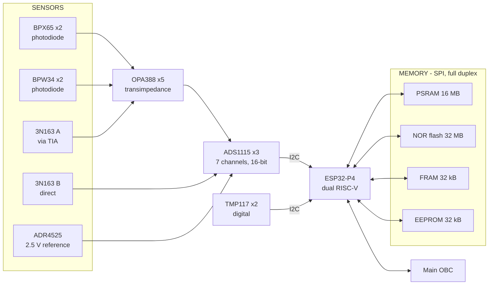
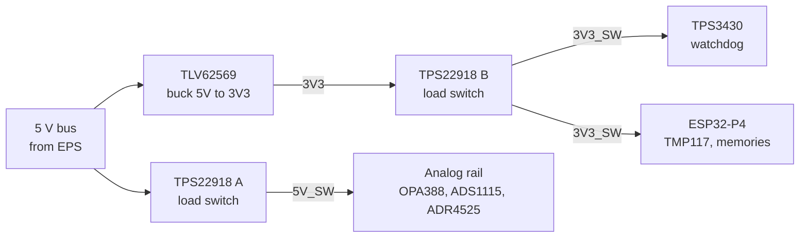
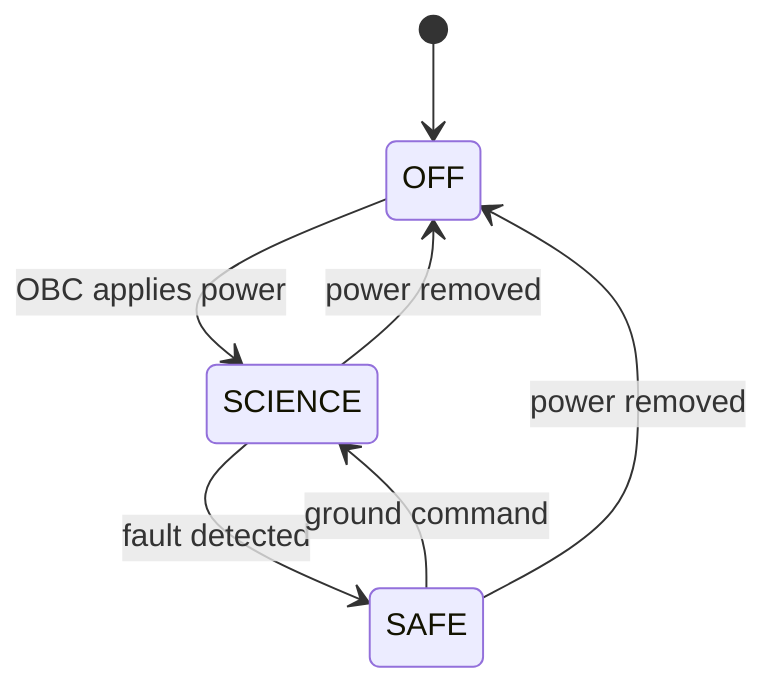

# SEED-P Payload — System Overview

An educational and scientific instrument package for a 500 km Sun-synchronous
CubeSat. It measures three radiation effects on commercial electronics -- upsets
in memory, displacement damage in photodiodes, and dose in MOSFET channels --
together with the temperature needed to interpret them.

| | |
|---|---|
| Orbit | 500 km SSO, i = 97.4 deg, period 94.6 min, 15.2 orbits/day |
| Sample rate | 1 Hz, all channels |
| Storage | hourly CSV files on payload flash, ring buffer |
| Spacecraft interface | UART to OBC, 115200 8N1, frame every 30 s |
| Data produced | 5.04 MB/day |

**Two things the payload deliberately does not do:** it has no clock, and it has
no radio. It reports seconds since its own boot and hands everything to the OBC.

---

## 1. Functional Description

- Measures displacement damage in four silicon photodiodes of two device types,
  by trending their dark current and responsivity across the mission.
- Monitors radiation-induced single-event upsets across three memory
  technologies -- PSRAM, FRAM and EEPROM.
- Monitors internal payload thermal conditions at two board locations.
- Records two 3N163 MOSFET channels, one amplified and one direct.
- Continuously monitors its own voltage reference as a calibration and
  data-integrity check.
- Samples all channels at 1 Hz and stores them on board in hourly files, managed
  as a ring buffer so logging never stops.
- Transmits the most recent 30 seconds of data to the satellite OBC every
  30 seconds over UART.
- Responds to OBC requests to list, close and re-send stored files, so data
  missed or corrupted in transit can be recovered.
- Generates datasets for aerospace engineering education, research and technology
  demonstration.

### Not performed by the payload

Stated explicitly, because absent capability is easy to assume present:

| | |
|---|---|
| Attitude or rate sensing | No IMU. Attitude is a spacecraft bus function. |
| Magnetic field measurement | No magnetometer. |
| Absolute timekeeping | No RTC. Records carry elapsed seconds; the OBC assigns UTC. |
| Ground downlink | The only external interface is the UART to the OBC. |
| Absorbed-dose measurement | Radiation is characterised by counting memory upsets. |

The time exclusion is the one worth reading twice. A clock the payload cannot
keep accurate across resets and thermal cycling would produce timestamps that
look authoritative and are not -- so it does not produce them at all.

---

## 2. Block Diagram

### 2.1 Signal chain



Seven analog channels reach three ADS1115 converters. Four photodiodes and one
3N163 pass through transimpedance amplifiers; the second 3N163 and the voltage
reference connect directly. The two TMP117 sensors are digital and bypass the
converters entirely.

**The two 3N163 channels are not equivalent.** One is amplified and one is not,
so they have different gain, noise floor and settling time. They will not report
the same value for the same input -- which is the point of the comparison, but it
must not be mistaken for a fault.

### 2.2 Power distribution



Two rails. The switched 5 V rail feeds everything analog; 3.3 V feeds the
processor, watchdog, temperature sensors and memories. The analog section can
therefore be gated independently of the digital section.

> **Schematic review item.** The processor sits behind a load switch it may also
> control. If that enable is driven by a processor GPIO, firmware can cut its own
> supply -- and the watchdog, which would otherwise recover it, drops out at the
> same instant. A pull-up so the rail defaults on is safer.

Vector versions of both diagrams for use in formal documents are in
[`img/`](img/).

---

## 3. Concept of Operations

### 3.1 Data flow

```
sensors --1 Hz--> payload RAM --30 s--> OBC --reduced--> ground
   |                    |
   +--- hourly file ----+
        payload flash, ring buffer
```

Three paths, deliberately independent:

| Path | Rate | Purpose |
|---|---|---|
| Payload to OBC | every 30 s | Live data, and the payload's liveness signal |
| Payload to flash | hourly | Recovery buffer, holds the most recent N hours |
| OBC to ground | ~5 passes/day | Whatever data product the mission defines |

The 30 s frame is sent from RAM and never reads the stored file, so a storage
fault does not stop the liveness signal.

### 3.2 Time

The payload reports **seconds since boot**. The OBC assigns absolute time:

1. On the first frame after a payload boot, the OBC records the payload's uptime
   against its own clock. That pair is the anchor.
2. Every later record is placed by interpolation from that anchor.
3. A payload restart resets uptime to zero. The OBC detects the sequence going
   backwards and creates a new anchor. Data under the old anchor keeps its
   original times.

### 3.3 Roles

| Actor | Responsibility |
|---|---|
| **Payload** | Sample, store, transmit every 30 s, answer commands. Never decides what is important. |
| **OBC** | Verify frames, assign UTC, reduce or store, monitor liveness, request recovery, control payload power. |
| **Ground** | Define the data product, task recovery of specific files, monitor trends. |

The payload has no view of the mission and makes no prioritisation decisions. All
selection happens above it.

### 3.4 Boot frame

Sent within milliseconds of power-on, before the console wait and before storage
is mounted:

```
<BOOT id=639A_ fw=2 rate=1Hz tx=30s file=3600s>
```

The OBC's restart-recovery procedure watches for this line rather than the first
data frame — it arrives in milliseconds instead of 30 seconds, and it
distinguishes *payload running but sampling stuck* from *payload not running*.

`639` identifies the payload type; the trailing letter identifies the board —
`A` flight, `B` spare, `E` engineering model. Without it, units produce
identically-named files that overwrite each other when collected together.

### 3.5 Commands

Optional -- the link works one-way without them.

| Command | Effect |
|---|---|
| `LIST` | Names and sizes of stored files |
| `STATUS` | Uptime, counters, free space |
| `CLOSE` | Roll the current file so it can be retrieved |
| `RESEND <name>` | Stream a stored file back |

`RESEND` is what makes the stored copy useful. Without it the files are
write-only and a corrupt or missed frame is unrecoverable.

### 3.6 Fault recovery

If no frame arrives for **90 seconds**, the OBC treats the payload as stuck:

| Step | Action | Timing |
|---|---|---|
| 1 | Remove payload power | hold 10 s |
| 2 | Restore power, watch for the boot frame | arrives ~1 s after power-on |
| 3 | Wait for the first data frame | 40 s |
| 4 | Frame received -> recovered, log the event | -- |
| 5 | No frame -> repeat from step 1 | ~55 s per attempt |
| 6 | After 5 minutes, 5 attempts -> hold power off, flag to ground | -- |

Three points decide whether this works:

**Watch for the boot frame, not the data frame.** The payload announces itself
about 1 second after power-on; the data frame only arrives at 30 s. It also
separates two different failures -- *boot frame but no data* means the payload is
running and its sampling loop is stuck; *nothing at all* means it is not running.

**Cut immediately on overcurrent.** Radiation-induced latch-up makes a device
draw far more than normal until power is removed. Power cycling is the correct
response, but cycling into a latched load five times can cause permanent damage.
One high-current reading should skip the retry budget entirely.

**The shutdown holds, it does not latch permanently.** An autonomous,
irreversible kill means one transient can end the payload mission. The OBC holds
power off and the ground re-enables on the next pass.

### 3.7 Contingencies

| Symptom | Likely cause | Response |
|---|---|---|
| Frame fails CRC | transient link corruption | `RESEND` that file |
| One frame missed | payload busy, link glitch | note the gap, recover later |
| No frame for 90 s | payload hung or unpowered | run the recovery sequence |
| Boot count jumps | watchdog reset or brownout | log reset cause, investigate on trend |
| Reference channel drifts | reference ageing, or parse misalignment | verify at ground before trusting affected data |
| Free space not recovering | ring buffer failure | `CLOSE`; if unresolved, power-cycle |

Filenames step by a fixed interval, so the OBC knows from the name alone exactly
which data is missing.

---

## 4. Operational Modes

Three modes. **The payload starts measuring automatically on power-up** -- no
command is required to begin operations.

| Mode | Description | Power | Data rate | Duration | Entry | Exit |
|---|---|---|---|---|---|---|
| **OFF** | Unpowered. No function. | 0 mW | -- | Launch, disposal, fault hold | OBC removes power | OBC applies power |
| **SCIENCE** | Normal operation. 1 Hz sampling, hourly files, frame to OBC every 30 s. | 350 mW avg<br>453 mW peak | 466 bps to storage<br>1.9 kB per 30 s to OBC | Continuous, indefinite | **Automatic on power-on** | Fault -> SAFE<br>Power removed -> OFF |
| **SAFE** | Fault detected. Sampling stopped, analog rail off. Memory scan and 30 s heartbeat continue with a short frame. | ~260 mW* | ~40 bps | Until ground intervenes | Autonomous, on sensor or storage fault | Ground command -> SCIENCE<br>Power removed -> OFF |

<sub>* Estimated. See the note under section 5.</sub>



**Why there is no standby mode.** Removing it is what makes fault recovery work.
The OBC's response to a silent payload is to power-cycle it, and that only
recovers anything if power-on means running. A payload that came up idle awaiting
a command would sit silent after every restart, and the OBC would keep cycling
it. If the payload ever needs to be quiet, the OBC cuts power -- same result,
unambiguous.

**A storage failure is survivable, not fatal.** If the filesystem fails to mount
the payload keeps sampling, displaying and transmitting; only the on-board
recovery buffer is lost, and `STATUS` reports `storage=FAILED`. Halting instead
would trigger the OBC's power-cycle recovery and eventually a latch-off — losing
the payload because a filesystem would not mount.

**Why SAFE still transmits.** The OBC judges liveness by whether frames keep
arriving, so a payload that stops talking looks dead and gets power-cycled --
even when a restart will not fix the fault. SAFE sends a short frame every 30 s
meaning *present, but degraded*. Silent is worse than degraded.

---

## 5. Duty Cycle & Mission Timeline

### 5.1 Mode duty cycle

| Mode | Share of mission |
|---|---|
| OFF | ~1% -- launch through detumble, and disposal |
| **SCIENCE** | **>99%** |
| SAFE | 0% expected; only on fault |

### 5.2 Activity duty cycle within SCIENCE

| Activity | Duty | Note |
|---|---|---|
| Sensor sampling | 100% | 1 Hz, continuous |
| Analog rail (5V_SW) | 100% | Held biased -- see below |
| Digital rail (3V3_SW) | 100% | |
| Memory scan | 100% | One scan per sample |
| Flash write | 100% | Flushed per row, bounding power-loss to one row |
| **UART transmit** | **0.55%** | 165 ms in each 30 s window |
| `RESEND`, when tasked | on demand | 18.2 s per hourly file |

**Nothing is duty-cycled except the link.** The analog front end stays powered
deliberately: cold-starting the amplifiers before each reading would let warm-up
offset drift imprint an orbital-period artefact on the science data. The 52 mW it
costs buys measurement stability.

The UART figure is the one for an interface budget -- the link is essentially
idle, leaving ample headroom for a faster rate or larger frames.

### 5.3 Timeline

| Interval | Samples | Frames to OBC | Files | Data |
|---|---|---|---|---|
| 30 s | 30 | 1 | -- | 1.75 kB |
| 1 hour | 3,600 | 120 | 1 | 205 kB |
| **1 orbit (94.6 min)** | **5,676** | **189** | **1.58** | **323 kB** |
| 1 day (15.2 orbits) | 86,400 | 2,880 | 24 | **5.04 MB** |
| 7 days | 604,800 | 20,160 | 168 | 35.3 MB |

### 5.4 Mission phases

| Phase | Duration | Payload state |
|---|---|---|
| Launch and separation | 0-24 h | OFF |
| Commissioning | 24-48 h | SCIENCE, from power-on |
| Nominal operations | to end of life | SCIENCE, continuous, unattended |
| Disposal | final pass | Final `CLOSE`, then OFF |

Commissioning is short, because there is no mode sequencing:

1. OBC applies power. Boot frame arrives within ~1 s.
2. First data frame at 30 s. Confirm CRC valid.
3. Confirm the reference channel reads a constant 2.56 V, temperatures are
   plausible, and photodiodes track the illumination cycle across one orbit.
4. Issue `CLOSE` then `RESEND`. Confirm a stored file returns byte-intact.
5. Declare operational.

**Step 4 is the one worth insisting on.** It exercises the recovery path before
anything depends on it, and an untested recovery path is not a recovery path.

### 5.5 Storage rollover

| Flash partition | History retrievable |
|---|---|
| 6 MB | ~21 hours |
| 12 MB | ~2 days |
| 30 MB | **~6 days** |

Logging never stops. Once the ring is full the oldest file is deleted as each new
one opens, so the payload always holds the most recent window and the ground can
request any hour within it by name.

---

## Open items

| Item | Why it matters |
|---|---|
| **Downlink data product** | The payload produces 5.04 MB/day against a ~370 kB/day UHF allocation -- about 14x over. Encoding cannot close this; it needs a decision about what reaches the ground. |
| **ESP32-P4 current draw** | Not measured. Bounding gives 35-85 mA, a factor of 2.4 on the figure that sizes the solar array. All power numbers here are preliminary until swept on a bench. |
| **3N163 function** | If these are RADFETs used for total-ionising-dose measurement, that is a distinct science objective and the dose exclusion in section 1 comes off. |
| **FRAM and EEPROM part numbers** | MB85R**C**256V and AT24C256C are I2C variants, but the design shows them on SPI. Either the part numbers or the diagram needs updating. |
| **PSRAM on-die ECC** | If the in-package PSRAM transparently corrects single-bit errors, the upset experiment measures zero for the entire mission while appearing healthy. Confirm with the vendor. |
